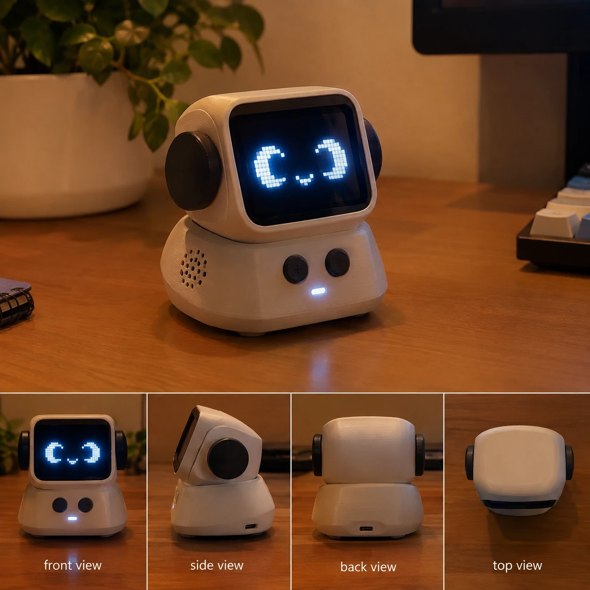
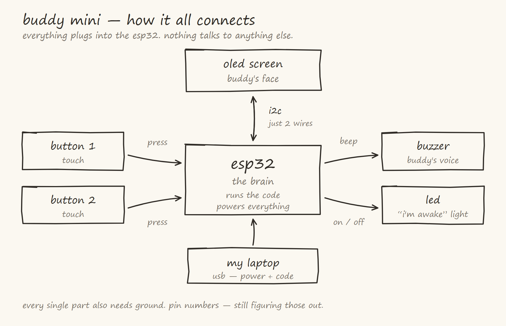
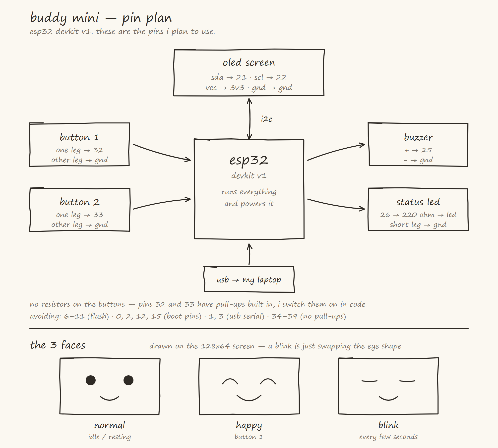

# buddy mini

a small desk buddy that reacts to me with animated eyes, sounds, and buttons.

i want it to feel like a little character sitting on my desk instead of just being
another circuit. this is my first step toward building a bigger desk robot that can
eventually move around, listen to me, and talk back.

built for **Hack Club Half Life**. i'm a beginner with hardware — this repo is the
real record of me learning it, not a polished tutorial.

---

## the design target



this is the *end goal* look — a 3D printed body with an OLED face. **v1 is not this.**
v1 is the same brain and face running on a bare breadboard. the case comes later.

---

## how it connects



## pin plan



## status

| version | what it is | state |
|---|---|---|
| v1 (warm-up) | breadboard prototype: OLED face, 2 buttons, buzzer, status LED | in progress |
| v2 | tidier wiring, more expressions, sleep mode | not started |
| v3 | 3D printed enclosure | not started |
| v4 (someday) | movement, mic, voice | out of scope for Half Life |

---

## what buddy mini v1 does

1. shows a simple animated face on a small OLED display
2. reacts when i press its buttons by changing its expression
3. makes different sounds when i interact with it
4. has a simple personality through different faces and reactions
5. blinks on its own every few seconds, even when i'm not touching it
6. has a status LED that shows it's awake

## what it does NOT do yet

- move around
- listen to or talk with me
- use a microphone
- use AI or voice recognition
- run on a battery (USB power only)
- require any soldering (breadboard only)
- have a 3D printed case

## definition of done for v1

buddy mini is finished when:

- the OLED displays its face
- the face can change between multiple expressions
- the buttons trigger different reactions
- the buzzer makes different sounds
- everything works together on the ESP32
- i can record a short video showing the finished prototype working

---

## repo layout

```
buddy-mini/
├── docs/            design notes, one file per planning step
├── firmware/        the ESP32 code (arrives in session 2)
├── journal/         session-by-session devlog
├── media/           reference images, build photos, videos
└── README.md
```

## docs

- [01 — scope](docs/01-scope.md) — what v1 is and isn't
- [02 — parts and what they do](docs/02-parts.md) — every component explained
- [03 — block diagram](docs/03-block-diagram.md) — how the five parts hang off the ESP32
- [04 — pin plan](docs/04-pin-plan.md) — which GPIO pins each part gets, and which pins are off-limits
- [05 — interactions and sounds](docs/05-interactions.md) — what each button does and what it sounds like
- [journal](journal/README.md) — the devlog

## hardware

everything comes from the **LAFVIN Basic Starter Kit for ESP32**.

| part | qty |
|---|---|
| ESP32 dev board | 1 |
| 0.96" SSD1306 OLED, 128x64, I²C | 1 |
| solderless breadboard | 1 |
| jumper wires (M-M, M-F, F-F) | 1 kit |
| tactile push buttons | 2 (kit has more) |
| passive piezo buzzer | 1 |
| LEDs | a few |
| 220Ω resistors | 1-2 |
| 10kΩ resistors | 0-2 (may not be needed, see docs/02) |
| USB **data** cable | 1 |

---

## time tracking

hours logged through Hackatime under project `buddy-mini`.
only time actually spent working on this counts.
